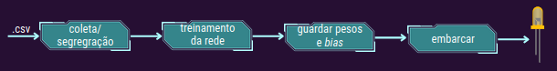
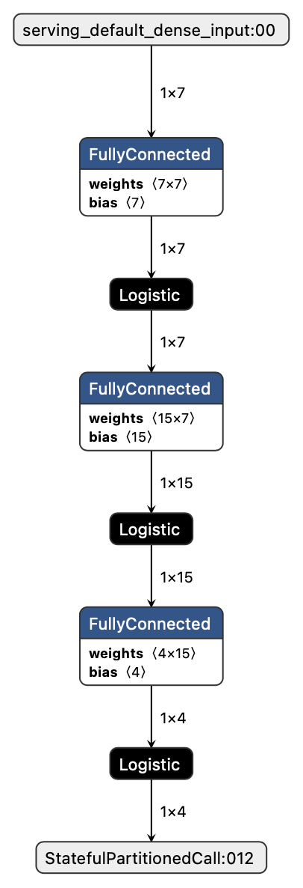

# Embarcando uma rede neural

*TinyML* é uma área de estudo que permeia os âmbitos de duas outras áreas, *Machine Learning* (ML) e Sistemas Embarcados. Esta busca explorar aplicações de ML, ma vez reduzidas, otimizadas e integradas, que possam ser executadas em dispositivos pequenos e limitados, como microcontroladores.

O desenvolvimento deste campo se deu de forma rápida e suas técnicas são amplamente usadas em diversas aplicações que combinam Internet das coisas ou *Internet of things* (IoT) com ML.

>"Em 2030, a demanda por dispositivos TinyML será cerca de 2.5 bilhões de unidades." ABI Research

Entre os benefícios do TinyML, podemos citar:
* *Processamento rápido de dados*: Como as aplicações exigem  um mínimo de manipulação e são otimizadas para serem executadas em dispositivos de borda, o processamento dos dados, etapa essencial, é feita de forma eficiente.

* *Baixa largura de banda*: Os dispositivos não necessitam de alta largura de banda, porque os dados são enviados apenas de tempos em tempos para a nuvem. Por exemplo, se a aplicação prevê um valor de tensão, os valores previstos podem ser acumulados temporariamente para serem enviados de uma só vez, poupando recursos.

* *Baixo custo energético*: Os microcontroladores, onde são implantadas as aplicações, requerem pouca energia e geralmente possuem baterias que duram dias.

* *Privacidade*: Ter os dados protegidos é um requisito extremamente desejado e importante que aplicações de TinyML oferecem. O fato das aplicações não persistem os dados e o controle de recebimento ficar a cargo da nuvem torna essa técnica extremamente segura.

## Objetivo do projeto
:dart: Desejamos receber como entrada valores de tensão que alimentam um display de 7 segmentos &ndash; ou seja, cada entrada contém 7 tensões, uma para cada pino &ndash; e **prever** a saída correspondente em binário.

### Pipeline

#### Coleta e segregação
Inicialmente, fizemos uso de uma base de dados com 3000 conjuntos de 7 amostras de entradas de tensão referentes ao controle da exibição de um determinado dígito em um display de 7 segmentos e 3000 amostras como saídas em BCD (*Binary-coded decimal*) correspondentes ao digito exibido no display. Uma vez importada a base, ela é dividida em 2 subconjuntos: um para `treino(80%)` e outro para `teste(20%)` da rede.

#### Treinamento da rede
Para realizar o treinamento foi usada uma MLP (*Multilayer Perceptron*) com 3 camadas. A entrada da rede consiste em 7 níveis de tensão que variam de 0 a 5V e representam os sinais para controlar um display de 7 segmentos, cada sinal um dos segmentos).  

A camada de entrada da rede contém `7 neurônios` que recebem os valores de tensão, para essa camada foi utilizada a função de ativação `tangente hiperbólica.` 

Para a camada oculta foram feitos alguns testes com números de neurônios diferentes e por fim foi decidido usar a camada com `15 neurônios` e com a função de ativação da `tangente hiperbólica.` 

A camada de saída contém  `4 neurônios` que representam justamente cada um dos dígitos do código BCD equivalente ao número apresentado no display de 7 segmentos. Para aumentar a acurácia, a função de ativação escolhida para essa camada foi a `sigmoid`, já que ela é a  melhor opção para dados que estejam entre 0 ou 1.

A função de otimização utilizada no treinamento da rede foi a ADAM, que é um método de descida gradiente estocástico que se baseia na estimativa adaptativa de momentos de primeira e segunda ordem, e como função de perda a entropia cruzada binária. Mais detalhes sobre essa implementação podem ser vistos aqui .

O resultado do treinamento pode ser visto na figura abaixo:

#### Guardar pesos e *bias*
Armazenamos os pesos e *bias* do modelo darede treinada. Este é um passo importante para fazer a integração da rede neural treinada com o dispositivo.

#### Embarcar
Importamos os dados de treino, pesos e *bias* para o ambiente de programação do microcontrolador, esses dados poderiam muito bem estar em um arquivo separado `.h`, mas como o ambiente de desenvolimento do `TinkerCAD` não dá suporte para isso, colocamos essas predefinições junto to arquivo contendo a main.

Para o calulo dos valores preditos da rede foi criada uma função "predict", que recebe 7 valores de entrada e aplica todos os pesos e bias, assim como faz o calculo saída da função de ativação.

Além de importar os pesos e bias para cada camada, tambem foi criada uma matriz que contém um subconjunto do conjunto de teste da rede, esse novo subconjunto será usado como entrada da função de predição criada. 

Por fim, deficimos usar 4 leds para que representar a saída em BCD, de maneira que cada led representa um digito do código. A cada segundo um novo exemplo de entrada do conjunto de teste é passado para função de predição e o resultado é apresentado nos leds. O sistema tem a seguinte configuração:

O projeto pode ser consultado no [Tinkercad](https://www.tinkercad.com/things/97xwU8PCmQD-glorious-jaban/editel?sharecode=_bOez_P5cmP0_7xw_ZJOTKmOZoCIdq-miHgJm79dRnU).

# Referências 

[Machine Learning Meets Embedded Systems](https://towardsdatascience.com/an-introduction-to-tinyml-4617f314aa79). Arun, Towards Data Science, Novembro de 2020.

[“What is TinyML, and why does it matter?”](https://towardsdatascience.com/what-is-tinyml-and-why-does-it-matter-f5b164766876). Jair Ribeiro, Towards Data Science, Dezembro de 2022.

[Global Shipments of TinyML Devices to Reach 2.5 Billion by 2030](https://www.prnewswire.com/news-releases/global-shipments-of-tinyml-devices-to-reach-2-5-billion-by-2030--301123076.html). ABI Research, Setembro de 2020. 
