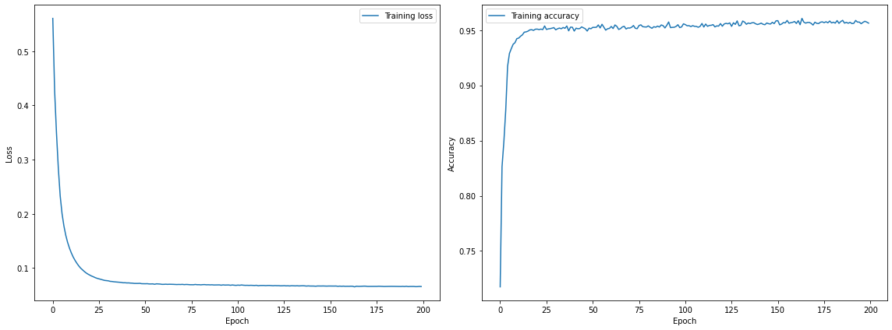
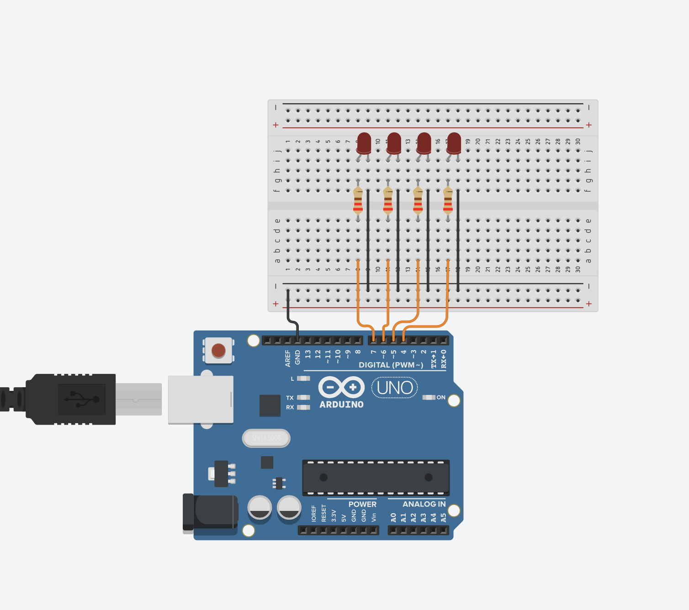

# Embarcando uma rede neural

*TinyML* é uma área de estudo que permeia os âmbitos de duas outras áreas, *Machine Learning* (ML) e Sistemas Embarcados. Esta busca explorar aplicações de ML, ma vez reduzidas, otimizadas e integradas, que possam ser executadas em dispositivos pequenos e limitados, como microcontroladores.

O desenvolvimento deste campo se deu de forma rápida e suas técnicas são amplamente usadas em diversas aplicações que combinam Internet das coisas ou *Internet of things* (IoT) com ML.

>"Em 2030, a demanda por dispositivos TinyML será cerca de 2.5 bilhões de unidades." ABI Research

Entre os benefícios do TinyML, podemos citar:
* *Processamento rápido de dados*: Como as aplicações exigem  um mínimo de manipulação e são otimizadas para serem executadas em dispositivos de borda, o processamento dos dados, etapa essencial, é feita de forma eficiente.

* *Baixa largura de banda*: Os dispositivos não necessitam de alta largura de banda, porque os dados são enviados apenas de tempos em tempos para a nuvem. Por exemplo, se a aplicação prevê um valor de tensão, os valores previstos podem ser acumulados temporariamente para serem enviados de uma só vez, poupando recursos.

* *Baixo custo energético*: Os microcontroladores, onde são implantadas as aplicações, requerem pouca energia e geralmente possuem baterias que duram dias.

* *Privacidade*: Ter os dados protegidos é um requisito extremamente desejado e importante que aplicações de TinyML oferecem. O fato das aplicações não persistem os dados e o controle de recebimento ficar a cargo da nuvem torna essa técnica extremamente segura.

## Objetivo do projeto
- :dart: Desejamos receber como entrada valores de tensão que alimentam um display de 7 segmentos &ndash; ou seja, cada entrada contém 7 tensões, uma para cada pino &ndash; e **prever** a saída correspondente em binário.

### Pipeline

#### Coleta e segregação
Inicialmente, coletamos os dados, que se trata de uma base de dados com 3000 amostras de entradas de tensão e 3000 amostras como saídas em BCD (*Binary-coded decimal*) correspondentes à entrada. Em seguida a base é dividida em treino (80%) e teste (20%).

#### Treinamento da rede
Para realizar o treinamento foi usada uma MLP (*Multilayer Perceptron*) com 3 camadas. As funções de ativação usadas foram a tangente hiperbólica e a sigmóide. A função de otimização ADAM, que é um método de descida gradiente estocástico que se baseia na estimativa adaptativa de momentos de primeira e segunda ordem, e como função de perda a entropia cruzada. Mais detalhes sobre essa implementação podem ser vistos aqui .
O resultado do treinamento pode ser visto na figura abaixo:

#### Guardar pesos e *bias*
Armazenamos os pesos e *bias* da rede treinada. Este é um passo importante para fazer a integração da rede neural treinada com o dispositivo.

#### Embarcar
Importamos os dados de treino, pesos e *bias* para o ambiente de programação do microcontrolador. Para representar a saída em BCD usamos 4 leds. O dispositivo tem a seguinte configuração:

O projeto pode ser consultado aqui: [`Tinkercad`](https://www.tinkercad.com/things/97xwU8PCmQD-glorious-jaban/editel?sharecode=_bOez_P5cmP0_7xw_ZJOTKmOZoCIdq-miHgJm79dRnU)

# Referências 

[Global Shipments of TinyML Devices to Reach 2.5 Billion by 2030](https://www.prnewswire.com/news-releases/global-shipments-of-tinyml-devices-to-reach-2-5-billion-by-2030--301123076.html). ABI Research, Setembro de 2020. 
